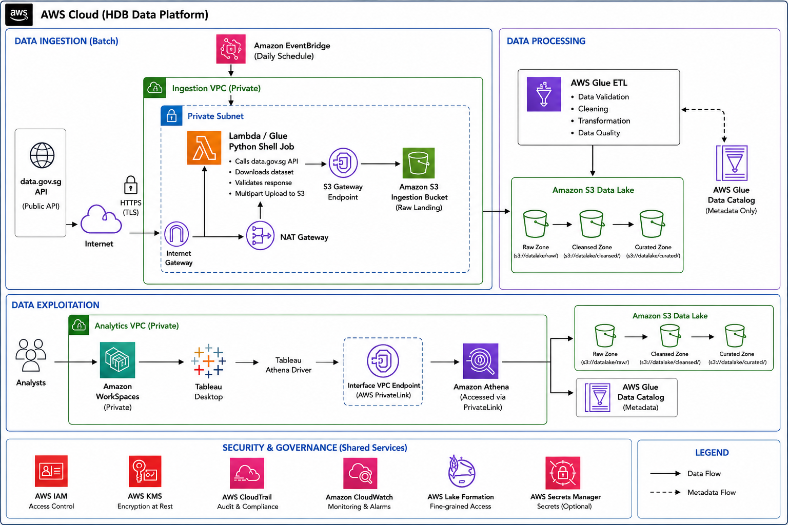

# HDB Data Engineer Role Technical Test Submission

## Part 1: ETL Pipeline
- Refer to `Part 1 ETL Pipeline/etl_pipeline.ipynb` for the complete ETL pipeline implementation, which includes the following steps:

1. Configuration & environment setup
2. Raw ingestion and schema harmonization
3. Cleaning, derivations, and validation
4. Anomaly detection via IQR bounds
5. Hashing + transformation
- The `resale_identifier` column fuses block digits, aggregated resale prices, the month, and the town initial into a compact key for each transaction.
- We apply SHA-256 to the identifier, ensuring the transformation is irreversible while preserving the one-to-one correspondence to the original value for uniqueness tracking.
- The hashed value is persisted in `resale_identifier_hash`, safeguarding linkage data without exposing the raw identifier.
6. Persistence of artifacts & summary statistics

## Part 2: Architecture Solution

- Refer to `Part 2 Architecture/AWS_architecture_diagram.png`

## How to run
1. Clone the repository to your local machine.
2. Ensure you have Python 3.11+ installed.
3. Run the `etl_pipeline.ipynb` notebook. The first code cell downloads every data.gov.sg collection-189 dataset whose coverage window overlaps `start_month`-`end_month` (`config/pipeline_config.yaml`) into `data/raw` automatically — no manual download step needed. Files already present in `data/raw` are left as-is and not re-downloaded.